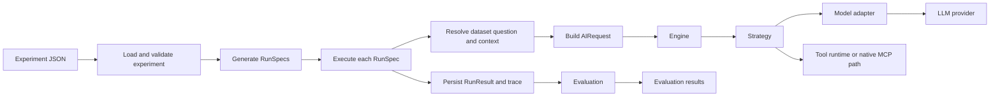
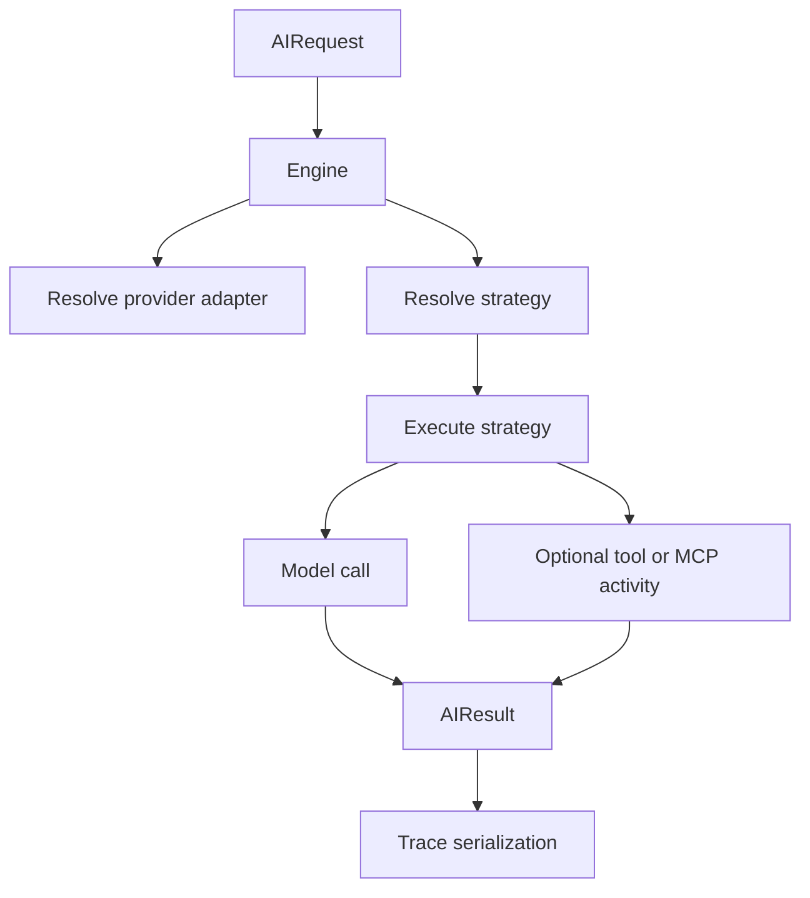
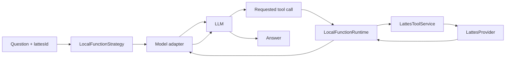
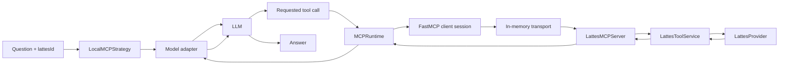
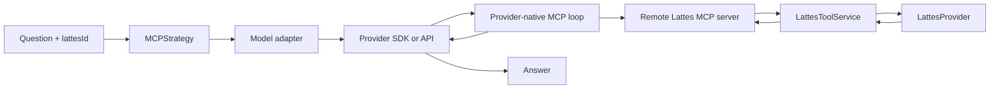

# COPA Benchmark

COPA is a benchmark runner for comparing how different LLM providers answer dataset-backed questions under multiple execution strategies.

The project is built around one core idea: keep the question set and evaluation constant while changing how the model gets access to information. In the current Lattes dataset, the same question can be answered through:

- direct inline context injection
- direct local function calls
- local MCP with a benchmark-controlled MCP client
- native remote MCP integration through the model provider SDK/API

## Purpose

COPA exists to make these strategy comparisons repeatable.

It provides:

- an experiment definition format
- runspec generation
- batch execution across providers, models, strategies, and formats
- trace capture for prompts, tool calls, MCP activity, usage, and errors
- automatic evaluation for exact, analytical, and unanswerable questions

In practice, `copa` is the CLI used to:

1. validate an experiment definition
2. expand it into concrete runspecs
3. execute the runs
4. evaluate the results

## CLI

Main commands:

```bash
copa experiment validate <experiment.json>
copa experiment expand <experiment.json> --out <runspec-dir> --jsonl <runspecs.jsonl>
copa run <runspec-dir-or-jsonl> --out <results-dir> --jsonl <run-results.jsonl>
copa eval --run-results-dir <results-dir> --experiment <experiment.json> --output-dir <eval-dir> --output-jsonl <eval.jsonl>
```

## Project Organization

The repository is split into a few main areas:

- `src/copa/cli.py`
  CLI entrypoint.
- `src/copa/commands/`
  CLI command handlers for experiment expansion, run execution, and evaluation.
- `src/copa/benchmark/`
  Experiment schema, runspec generation, execution wiring, result persistence, and evaluation.
- `src/copa/ai/`
  Model adapters, strategies, tracing, rate control, and runtimes.
- `src/copa/dataset/`
  Generic dataset loading and question/context handling.
- `src/copa/datasets/lattes/`
  Lattes-specific provider, tools, models, and MCP server.
- `examples/datasets/`
  Example experiment definitions and example datasets.
- `datasets/lattes/`
  Main Lattes dataset and a sample experiment file.

## Architecture

At a high level, the benchmark has three layers:

1. Dataset and experiment layer
   Loads questions, contexts, question instances, and experiment factors.

2. Execution layer
   Expands experiments into runspecs and executes each runspec through one strategy.

3. Evaluation layer
   Scores outputs against gold answers or rubric-based criteria.

### Core Components

**Dataset core**

- `DatasetProvider` loads questions, contexts, and instances from a dataset root.
- `Experiment` and `RunSpec` define the benchmark input objects.

**Execution core**

- `Engine` resolves the model adapter and strategy for each request.
- `execute_runspec()` in the benchmark layer prepares the request and persists traces/results.
- `TraceCollector` captures prompt, model, tool, MCP, retry, and error events.

**Model adapters**

- `OpenAIModel`
- `ClaudeModel`
- `GeminiModel`
- `MockModel`

Each adapter translates a provider-neutral request into provider-specific SDK/API payloads.

**Strategies**

- `InlineStrategy`
- `LocalFunctionStrategy`
- `LocalMCPStrategy`
- `MCPStrategy`

Each strategy decides how the model gets access to external information.

**Lattes domain layer**

- `LattesProvider`
  Resolves and parses curriculum artifacts.
- `LattesToolService`
  Exposes the stateless logical tool set keyed by `lattesId`.
- `LattesMCPServer`
  FastMCP server exposing the same logical tools over MCP.

## Benchmark Flow



## Execution Flow Inside the Engine



## Strategies

### `inline`

The model receives the full context directly in the prompt.

Use this when you want a no-tools baseline.

Properties:

- no tool calls
- no MCP
- context format matters because the prompt includes the raw artifact

Flow:


### `local_function`

The benchmark controls the call loop and exposes local Python tools directly.

This is the lowest-overhead tool-using condition. The model sees tool schemas, requests tool calls, and the benchmark executes them in-process without MCP.

Properties:

- benchmark-controlled tool loop
- direct Python tool invocation
- no protocol transport
- tools are stateless and require explicit `lattesId`

Flow:



### `local_mcp`

The benchmark still controls the call loop, but the tools are reached through a real MCP client/runtime using FastMCP in-memory transport.

This isolates the effect of MCP semantics and protocol mediation while keeping the execution local and controlled by the benchmark.

Properties:

- benchmark-controlled tool loop
- real MCP client path
- FastMCP in-memory transport
- same logical Lattes tool API as the other tool-based strategies

Flow:



### `mcp`

This is the native remote MCP strategy.

The benchmark does not control the tool loop here. Instead, it provides remote MCP server configuration to the model provider, and the provider SDK/API decides how to interact with the MCP server.

Properties:

- provider-controlled MCP loop
- remote MCP endpoint
- benchmark still records answer, usage, raw response, and whatever native MCP metadata the provider exposes

Current provider behavior:

- OpenAI
  Native remote MCP tool config via the Responses API.
- Anthropic
  Native remote MCP connector via the beta Messages API.
- Gemini
  Uses a FastMCP-backed client session created by `MCPRuntime`, then hands that session to the Gemini SDK.

Flow:



## Lattes MCP Server

The Lattes MCP server is implemented with FastMCP and exposes one logical tool catalog. It is format-agnostic from the model’s point of view.

The model never selects JSON vs HTML explicitly. The server resolves the best available backing artifact for the given `lattesId` internally.

Exposed tools:

- `basicInformation(lattesId)`
- `education(lattesId)`
- `linesOfResearch(lattesId)`
- `listProjects(lattesId, startYear?, endYear?)`
- `listPublications(lattesId, startYear?, endYear?)`

### Running the server

With the module entrypoint:

```bash
uv run python -m copa.datasets.lattes.mcp_server --transport streamable-http
```

FastMCP CLI-compatible:

```bash
fastmcp inspect src/copa/datasets/lattes/mcp_server.py:mcp
fastmcp run src/copa/datasets/lattes/mcp_server.py:mcp --transport http
```

## Remote MCP Configuration

For native `mcp`, the benchmark expects remote MCP server configuration under `params.common.mcp_server` or model-specific params.

Recommended benchmark-facing shape:

```json
{
  "mcp_server": {
    "server_url": "${LATTES_MCP_URL}",
    "auth_token": "${LATTES_MCP_TOKEN}",
    "server_label": "lattes"
  }
}
```

Environment precedence:

- values may come from the experiment file
- `LATTES_MCP_URL` overrides `mcp_server.server_url`
- `LATTES_MCP_TOKEN` overrides `mcp_server.auth_token`

The benchmark-facing field is `auth_token`. Adapters map it internally into provider-specific payloads.

## Evaluation

COPA supports three evaluation modes:

- `exact`
  Exact comparison or judge-assisted extraction followed by deterministic comparison.
- `analytical`
  Rubric- or dimension-based scoring.
- `unanswerable`
  Detects valid abstention behavior.

Evaluation runs after execution and produces structured evaluation artifacts separate from raw run results.

## Development

Without Nix:

```bash
uv sync --all-extras
uv run pytest
```

With Nix:

```bash
nix develop
pytest
```

## Typical Workflow

Validate an experiment:

```bash
copa experiment validate examples/datasets/experiment.json
```

Expand it:

```bash
copa experiment expand examples/datasets/experiment.json --out outputs/runspecs --jsonl outputs/runspecs.jsonl
```

Run the benchmark:

```bash
copa run outputs/runspecs --out outputs/run-results --jsonl outputs/run-results.jsonl
```

Evaluate:

```bash
copa eval --run-results-dir outputs/run-results --experiment examples/datasets/experiment.json --output-dir outputs/eval --output-jsonl outputs/eval.jsonl
```
