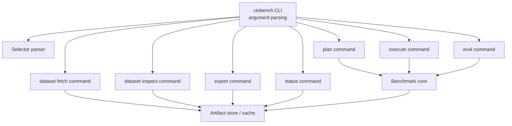

# CLI Architecture

## Purpose

The CLI exposes both dataset-management commands and lifecycle commands.

```text
ctxbench dataset fetch
ctxbench dataset inspect
ctxbench plan
ctxbench execute
ctxbench eval
ctxbench export
ctxbench status
```

The CLI should remain thin: parse arguments, resolve selectors, and delegate to command handlers.

## CLI component structure



## Command groups

### Dataset-management commands

| Command | Responsibility |
|---|---|
| `ctxbench dataset fetch` | Materialize a dataset into the local cache. |
| `ctxbench dataset inspect` | Validate and report capability/provenance for a local or cached dataset reference. |

### Lifecycle commands

| Command | Responsibility |
|---|---|
| `ctxbench plan` | Expand experiment into trials. |
| `ctxbench execute` | Execute trials and collect responses. |
| `ctxbench eval` | Evaluate responses. |
| `ctxbench export` | Build analysis-ready files. |
| `ctxbench status` | Report progress from existing artifacts. |

Lifecycle commands do not fetch remote datasets implicitly.

## Common selectors

Recommended selectors:

```text
--model
--provider
--instance
--task
--strategy
--format
--repetition
--trial
--trial-file
--status
--judge
```

## Nested subparser pattern

The parser shape is:

```text
ctxbench
  dataset
    fetch
    inspect
  plan
  execute
  eval
  export
  status
```

`ctxbench dataset` requires a subcommand.

## Historical migration reference

The table below is a migration reference only. Public CLI commands and selectors use the target
forms only and do not expose aliases. For the authoritative artifact reference, see
`docs/architecture/artifact-contracts.md`.

| Current | Target |
|---|---|
| `copa` | `ctxbench` |
| `query` | `execute` |
| `exec` | prohibited abbreviation; use `execute` |
| `queries.jsonl` | `trials.jsonl` |
| `answers.jsonl` | `responses.jsonl` |
| `--question` | `--task` |
| `--repeat` | `--repetition` |
| `--ids` | `--trial` |
