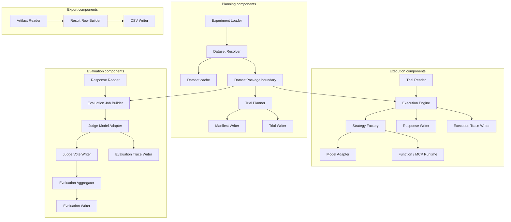

# C4 — Component Diagram

## Diagram



## Component notes

The components are implemented as Python modules. During migration, some implementation details may
still live behind compatibility adapters, but the target ownership is:

```text
ctxbench.cli
ctxbench.commands
ctxbench.benchmark
ctxbench.dataset
ctxbench.ai
```
