# C4 — Component Diagram

## Diagram

```mermaid
flowchart TB
    subgraph Planning["Planning components"]
        ExperimentLoader["Experiment Loader"]
        DatasetProvider["Dataset Provider"]
        TrialPlanner["Trial Planner"]
        ManifestWriter["Manifest Writer"]
        TrialWriter["Trial Writer"]
    end

    subgraph Execution["Execution components"]
        TrialReader["Trial Reader"]
        ExecutionEngine["Execution Engine"]
        StrategyFactory["Strategy Factory"]
        ModelAdapter["Model Adapter"]
        ToolRuntime["Function / MCP Runtime"]
        ResponseWriter["Response Writer"]
        ExecutionTraceWriter["Execution Trace Writer"]
    end

    subgraph Evaluation["Evaluation components"]
        ResponseReader["Response Reader"]
        EvalJobBuilder["Evaluation Job Builder"]
        JudgeAdapter["Judge Model Adapter"]
        VoteWriter["Judge Vote Writer"]
        EvalAggregator["Evaluation Aggregator"]
        EvalWriter["Evaluation Writer"]
        EvalTraceWriter["Evaluation Trace Writer"]
    end

    subgraph Export["Export components"]
        ArtifactReader["Artifact Reader"]
        RowBuilder["Result Row Builder"]
        CsvWriter["CSV Writer"]
    end

    ExperimentLoader --> DatasetProvider
    DatasetProvider --> TrialPlanner
    TrialPlanner --> ManifestWriter
    TrialPlanner --> TrialWriter

    TrialReader --> ExecutionEngine
    ExecutionEngine --> StrategyFactory
    StrategyFactory --> ModelAdapter
    StrategyFactory --> ToolRuntime
    ExecutionEngine --> ResponseWriter
    ExecutionEngine --> ExecutionTraceWriter

    ResponseReader --> EvalJobBuilder
    EvalJobBuilder --> JudgeAdapter
    JudgeAdapter --> VoteWriter
    VoteWriter --> EvalAggregator
    EvalAggregator --> EvalWriter
    JudgeAdapter --> EvalTraceWriter

    ArtifactReader --> RowBuilder
    RowBuilder --> CsvWriter
```



## Component notes

The components are implemented as Python modules. During migration from the current implementation, names may still appear under the legacy package name.

Target package areas:

```text
ctxbench.cli
ctxbench.commands
ctxbench.benchmark
ctxbench.dataset
ctxbench.strategies
ctxbench.models
ctxbench.mcp
ctxbench.tracing
```
