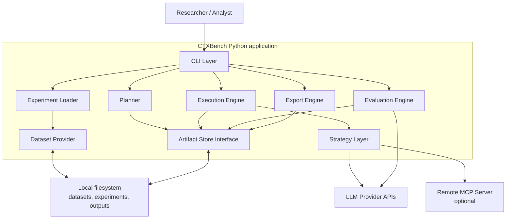

# C4 — Container Diagram

## Diagram

## Containers

| Container | Responsibility |
|---|---|
| CLI Layer | Parses commands and arguments. |
| Experiment Loader | Loads and validates experiment definitions. |
| Dataset Provider | Provides domain-neutral access to dataset inputs. |
| Planner | Generates `trials.jsonl` and `manifest.json`. |
| Execution Engine | Executes trials and writes responses/traces. |
| Strategy Layer | Implements context provisioning alternatives. |
| Evaluation Engine | Evaluates responses and writes eval artifacts. |
| Export Engine | Produces derived analysis artifacts. |
| Artifact Store Interface | Reads/writes local JSONL, JSON, CSV, and traces. |
