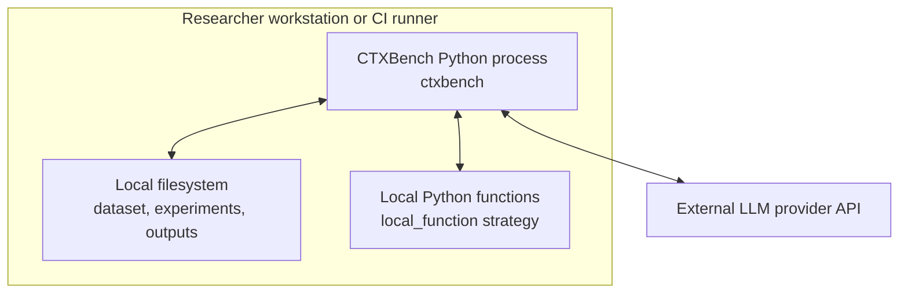
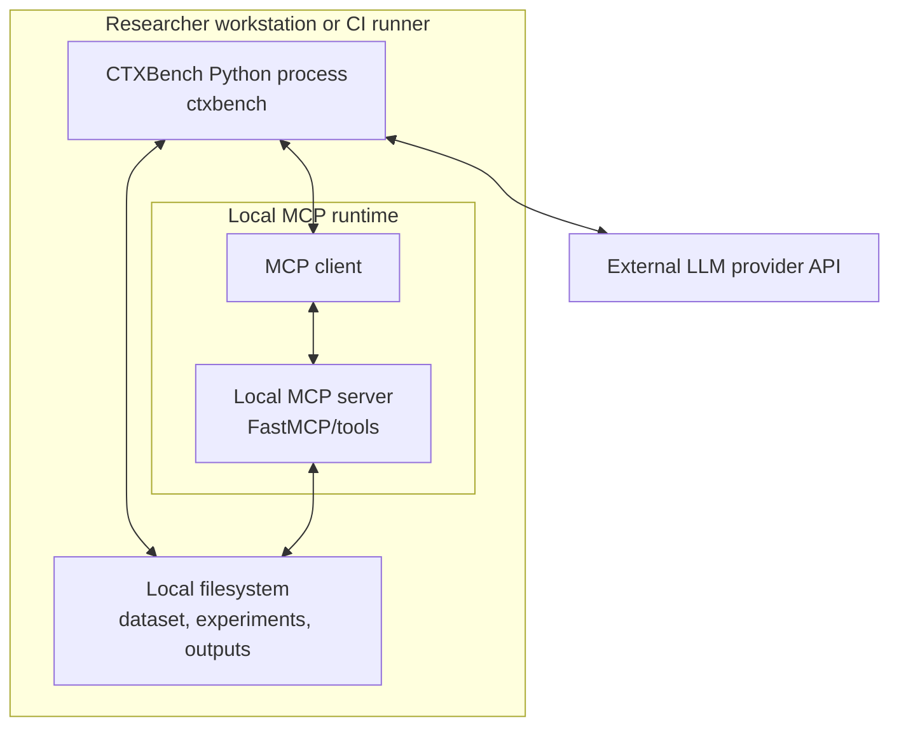
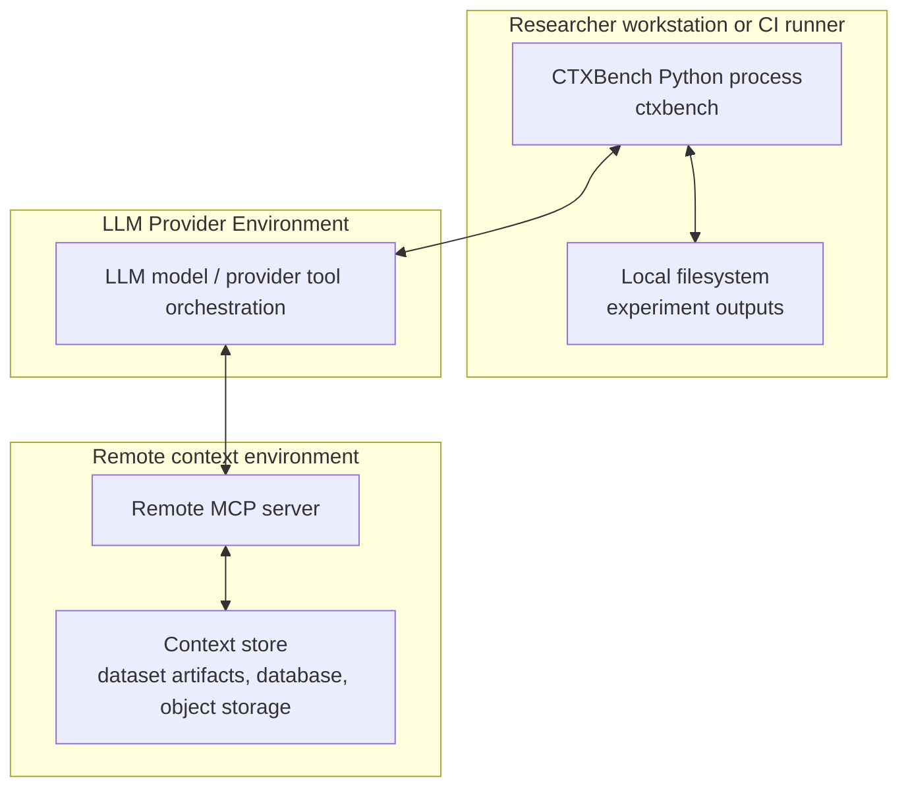

# C4 — Deployment Diagram

## Purpose

This diagram documents the physical/runtime topology.

This is the best C4 view for showing where the CTXBench Python process runs, where artifacts are stored, where LLM providers are called, and how local and remote MCP differ.

## Deployment: inline and local function strategies



## Deployment: local MCP strategy



## Deployment: remote MCP strategy



## Deployment notes

| Strategy | Runtime topology |
|---|---|
| `inline` | CTXBench reads local context and sends it to provider in the model input. |
| `local_function` | CTXBench executes local Python functions that read local dataset artifacts. |
| `local_mcp` | CTXBench uses a local MCP client/server boundary, usually with local files. |
| `remote_mcp` | Provider/model interacts with a remote MCP server that reads a remote or service-side context store. |

## Why deployment matters for MCP

The remote MCP strategy changes the physical architecture:

```text
- context serving moves out of the CTXBench process
- a network boundary is introduced
- part of the tool loop may become provider-managed
- observability can decrease
- latency and availability become deployment concerns
```

Therefore, remote MCP should be documented primarily with a C4 deployment diagram and complemented by a dynamic diagram.
