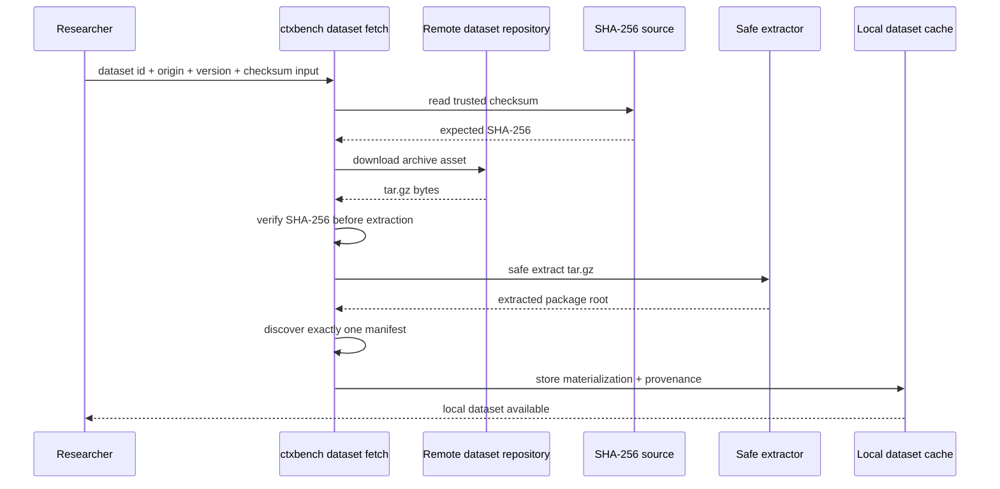
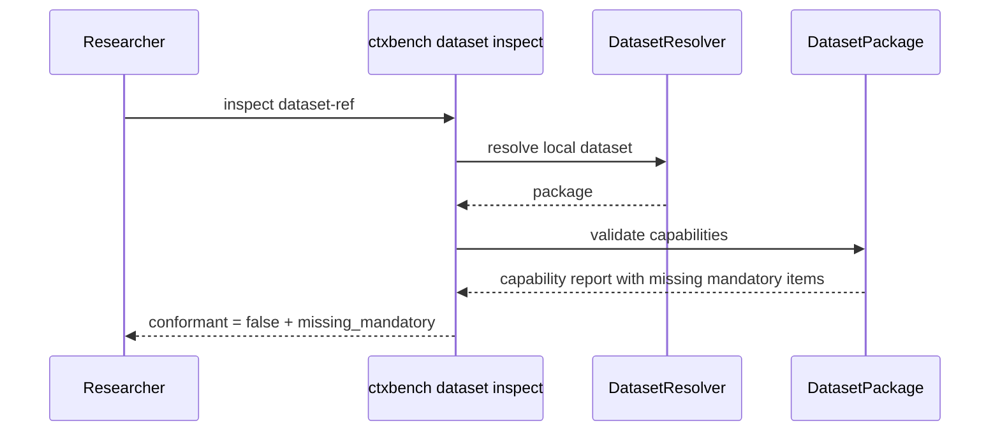
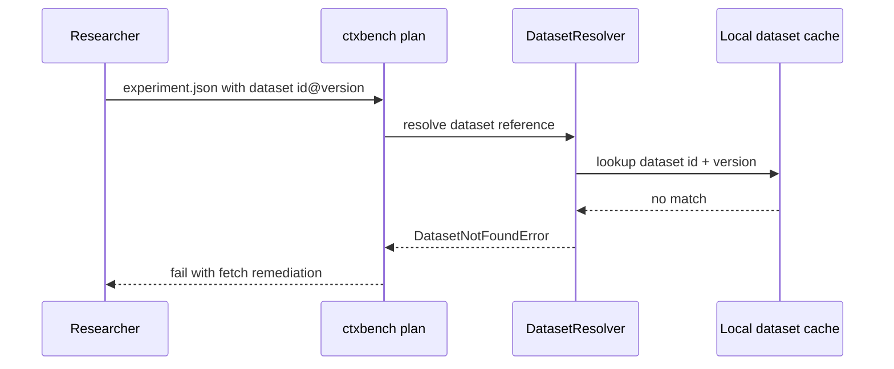
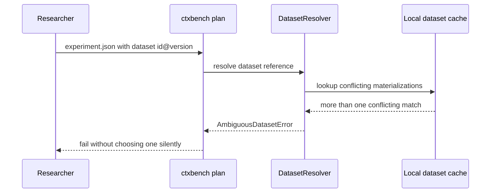

# C4 — Dynamic Diagrams

## Purpose

Dynamic diagrams document runtime behavior for the dataset-distribution flow added by Spec 003.

## Successful remote dataset fetch

## Inspect reports a non-conformant package

## Plan rejected on missing dataset

## Plan rejected on ambiguous dataset

