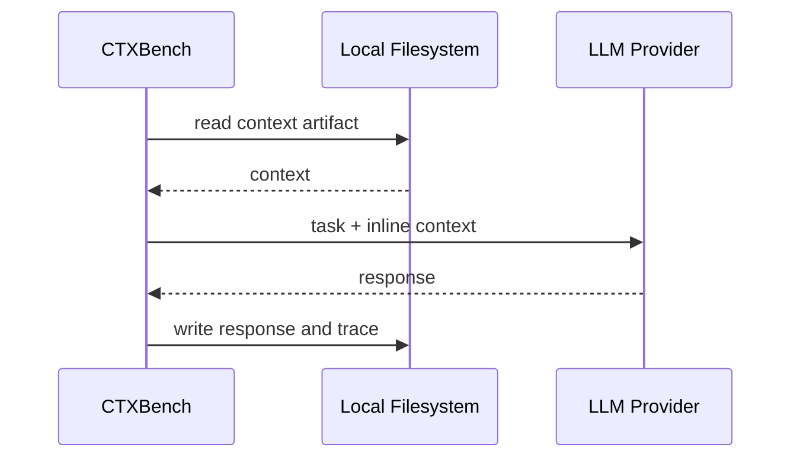
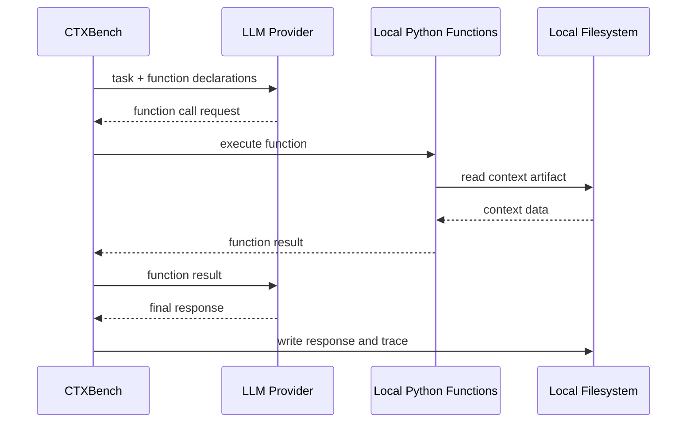
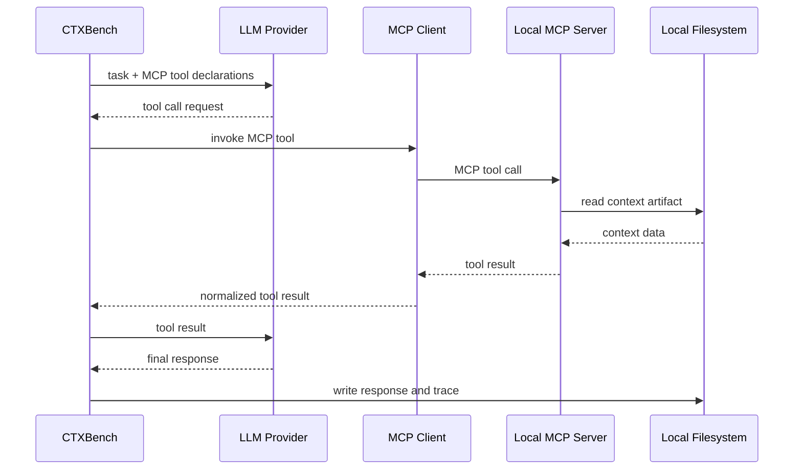
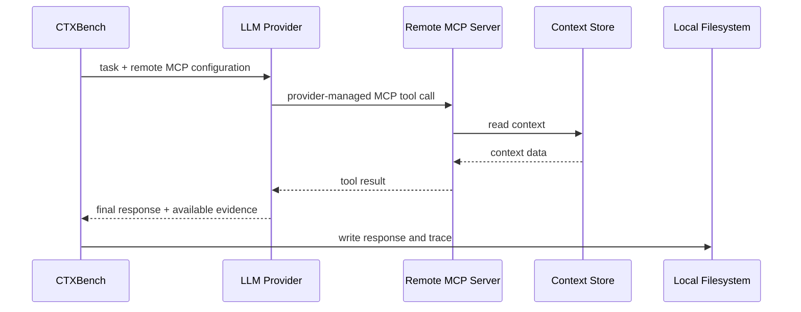

# C4 — Dynamic Diagrams

## Purpose

Dynamic diagrams document runtime behavior: how components interact during a scenario.

This is the best C4 view for explaining MCP operation loops, tool calls, and strategy-specific flows.

## Inline execution



## Local function execution



## Local MCP execution



## Remote MCP execution



## What MCP does in these flows

MCP introduces a client/server protocol boundary for context access.

The MCP server exposes tools with:

```text
name
description
input schema
output structure
error behavior
```

The MCP client invokes those tools. In `local_mcp`, CTXBench controls the MCP client. In `remote_mcp`, the provider may control or mediate MCP calls.

## Runtime implications

| Concern | Local MCP | Remote MCP |
|---|---|---|
| Loop control | CTXBench | Provider/remote integration may control |
| Tool observability | High | Lower |
| Network boundary | Local only | Remote |
| Context service reuse | Medium | High |
| Latency risk | Lower | Higher |
| Token/call accounting | More direct | Provider-specific / partial |

## MCP failure modes

```text
tool not called
wrong tool selected
invalid arguments
tool timeout
remote server unavailable
provider hides intermediate calls
tool output too large
tool output too unstructured
model stops before collecting enough evidence
```
