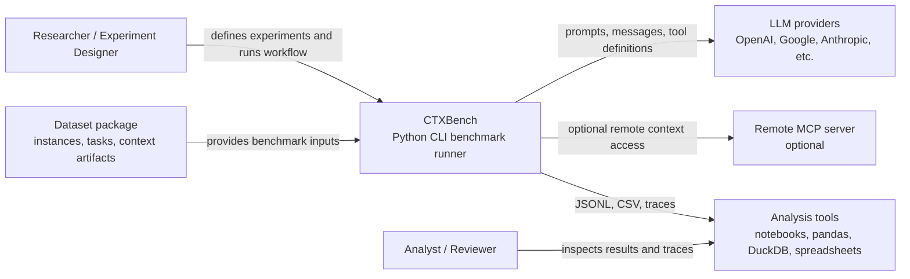

# C4 — System Context

## Diagram

## Explanation

CTXBench is a local/CI-executed research tool that orchestrates benchmark experiments over dataset packages and LLM providers.

It can optionally interact with remote MCP servers when evaluating protocol-based context provisioning.
