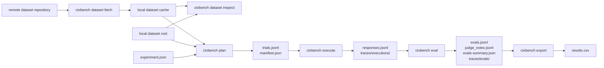

# Workflow

## Overview

CTXBench has two related flows:

1. dataset acquisition and inspection
2. benchmark lifecycle

Remote datasets are fetched explicitly before planning. Local-path datasets can skip the fetch
step and go straight to inspection or planning.



## Planning

```bash
ctxbench plan experiments/lattes_baseline_001.json --output outputs/lattes_baseline_001
```

Produces:

```text
manifest.json
trials.jsonl
```

## Execution

```bash
ctxbench execute outputs/lattes_baseline_001/trials.jsonl
```

Produces:

```text
responses.jsonl
traces/executions/<trialId>.json
```

## Evaluation

```bash
ctxbench eval outputs/lattes_baseline_001/responses.jsonl
```

Produces:

```text
evals.jsonl
judge_votes.jsonl
traces/evals/<trialId>.json
evals-summary.json
```

## Export

```bash
ctxbench export outputs/lattes_baseline_001/evals.jsonl --format csv --output outputs/lattes_baseline_001/results.csv
```

Produces:

```text
results.csv
```

## Status

```bash
ctxbench status outputs/lattes_baseline_001
ctxbench status outputs/lattes_baseline_001 --by judge
```

## Local-path shortcut

If the experiment uses `dataset.root`, the workflow becomes:

```text
ctxbench dataset inspect <dataset-root>
ctxbench plan
ctxbench execute
ctxbench eval
ctxbench export
```

No fetch step is required.

## Strategies

| Strategy | Description |
|---|---|
| `inline` | Inserts the selected context artifact directly into the model input. |
| `local_function` | Exposes local Python functions while CTXBench controls the tool loop. |
| `local_mcp` | Exposes tools through a local MCP runtime while CTXBench controls the loop. |
| `remote_mcp` | Uses a remote MCP server; provider or remote integration may control part of the loop. |

For detailed runtime flows, see `dynamic.md`.

For physical deployment/topology see `deployment.md`.
