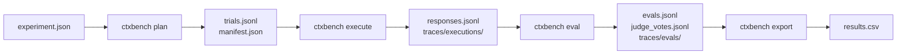

# Workflow

## Overview



## Planning

```bash
ctxbench plan experiments/lattes_baseline_001.json   --output outputs/lattes_baseline_001
```

Produces:

```text
manifest.json
trials.jsonl
```

## Execution

```bash
ctxbench execute outputs/lattes_baseline_001/trials.jsonl
```

Produces:

```text
responses.jsonl
traces/executions/<trialId>.json
```

## Evaluation

```bash
ctxbench eval outputs/lattes_baseline_001/responses.jsonl
```

Produces:

```text
evals.jsonl
judge_votes.jsonl
traces/evals/<trialId>.json
evals-summary.json
```

## Export

```bash
ctxbench export outputs/lattes_baseline_001/evals.jsonl   --to csv   --output outputs/lattes_baseline_001/results.csv
```

Produces:

```text
results.csv
```

## Status

```bash
ctxbench status outputs/lattes_baseline_001
ctxbench status outputs/lattes_baseline_001 --by judge
```

## Strategies

| Strategy | Description |
|---|---|
| `inline` | Inserts the selected context artifact directly into the model input. |
| `local_function` | Exposes local Python functions while CTXBench controls the tool loop. |
| `local_mcp` | Exposes tools through a local MCP runtime while CTXBench controls the loop. |
| `remote_mcp` | Uses a remote MCP server; provider/remote integration may control part of the loop. |

For detailed runtime flows, see `c4-dynamic.md`.

For physical deployment/topology, see `c4-deployment.md`.
